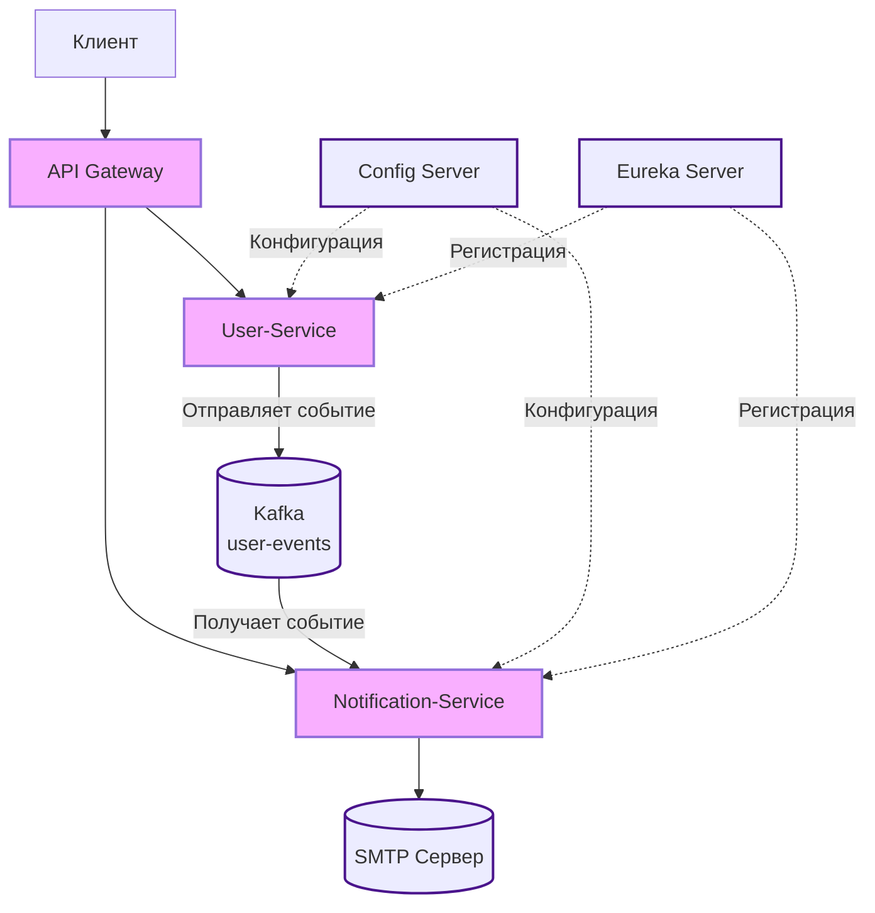

# 📧 Распределенная система уведомлений на Spring Cloud

[](https://spring.io/projects/spring-boot)
[](https://spring.io/projects/spring-cloud)
[](https://kafka.apache.org)
[](https://openjdk.org/projects/jdk/17/)
[](https://gradle.org)

Распределенная система для управления пользователями и асинхронной отправки уведомлений, построенная на микросервисной архитектуре с использованием Spring Cloud.

## 🚀 Функционал

### User-Service
- **Регистрация пользователей** с email и паролем
- **Удаление пользователей** (требуется аутентификация)
- **JWT-аутентификация** с помощью Spring Security
- **Асинхронная коммуникация** - отправка событий в Kafka при операциях с пользователями

### Notification-Service
- **Обработка событий** из Kafka топика `user-events`
- **Автоматическая отправка email** при создании/удалении пользователей
- **REST API** для ручной отправки произвольных уведомлений
- **Интеграция с SMTP-сервером**

### Spring Cloud Infrastructure
- **Единая точка входа** через Spring Cloud Gateway
- **Сервис-дискавери** с Netflix Eureka
- **Централизованная конфигурация** через Config Server
- **JWT-аутентификация** на уровне шлюза
- **Rate limiting** для защиты API

## 🏗️ Архитектура системы



**Поток данных:**
1. Клиент обращается к API Gateway
2. Gateway проверяет JWT и перенаправляет запрос в нужный сервис через Eureka
3. User-Service при создании/удалении пользователя отправляет событие в Kafka
4. Notification-Service получает событие из Kafka и отправляет email через SMTP

## 🛠️ Технологический стек

### Backend Framework
- **Spring Boot 3.x** - основной фреймворк для разработки микросервисов
- **Spring Security + JWT** - система аутентификации и авторизации
- **Spring Data JPA** - работа с реляционными базами данных
- **Spring Kafka** - интеграция с Apache Kafka для асинхронной messaging
- **Spring Mail** - отправка электронных писем через SMTP

### Spring Cloud Infrastructure
- **Spring Cloud Gateway** - API шлюз для маршрутизации и фильтрации запросов
- **Netflix Eureka** - сервер для регистрации и обнаружения микросервисов
- **Spring Cloud Config** - централизованное управление конфигурациями

### Database & Messaging
- **H2/PostgreSQL** - реляционная база данных
- **Apache Kafka** - брокер сообщений для асинхронной коммуникации

### Testing
- **Testcontainers** - фреймворк для интеграционного тестирования с Docker-контейнерами
- **JUnit 5** - фреймворк для модульного тестирования

### Build Tool
- **Gradle (Kotlin DSL)** - система сборки проекта

## 📦 Установка и запуск

### Предварительные требования
- Java 17 или выше
- Gradle 7.6+
- Docker и Docker Compose
- Git

### 1. Клонирование репозитория
```bash
git clone https://github.com/your-username/notification-system.git
cd notification-system
```

### 2. Запуск инфраструктуры
```bash
# Запуск Kafka, Zookeeper и других сервисов
docker-compose -f docker-compose-infra.yml up -d
```

### 3. Запуск микросервисов в правильном порядке
```bash
# 1. Запуск Config Server
cd config-server
./gradlew bootRun

# 2. Запуск Eureka Server (в новом терминале)
cd eureka-server  
./gradlew bootRun

# 3. Запуск API Gateway (в новом терминале)
cd api-gateway
./gradlew bootRun

# 4. Запуск микросервисов (в новых терминалах)
cd user-service
./gradlew bootRun

cd notification-service
./gradlew bootRun
```

### Альтернативно: запуск всех сервисов через Gradle
```bash
# Из корневой директории проекта
./gradlew :config-server:bootRun &
./gradlew :eureka-server:bootRun &
./gradlew :api-gateway:bootRun &
./gradlew :user-service:bootRun &
./gradlew :notification-service:bootRun &
```

### 4. Проверка работы
- **Eureka Dashboard**: http://localhost:8761
- **API Gateway**: http://localhost:8081
- **Config Server**: http://localhost:8888
- **Notification Service**: http://localhost:8083
- **User Service**: http://localhost:9092


---

> ⚠️ **Внимание:** Выше описана текущая реализация проекта. Ниже находится первоначальное ТЗ и планы, которые еще не реализованы,
> или реализованы, но не так как описано ниже. К примеру, endpoint-ы реализованы по другому. Testcontainer-ы на данный
> момент не добавлены.

## 🚧 Далее следует первоначальное ТЗ (не полностью соотвествует действительности)

## 🔌 API Endpoints

### Через API Gateway (порт 8080)

#### User-Service
```http
POST /api/users/register
Content-Type: application/json

{
  "email": "user@example.com",
  "password": "password123"
}

DELETE /api/users/{id}
Authorization: Bearer {jwt-token}
```

#### Notification-Service
```http
POST /api/notifications/send
Authorization: Bearer {jwt-token}
Content-Type: application/json

{
  "to": "user@example.com",
  "subject": "Тема письма",
  "text": "Текст уведомления"
}
```

## ⚙️ Конфигурация

### Основные настройки (в Config Server)
```yaml
spring:
  kafka:
    bootstrap-servers: localhost:9092
  mail:
    host: smtp.gmail.com
    port: 587
    username: ${MAIL_USERNAME}
    password: ${MAIL_PASSWORD}

eureka:
  client:
    service-url:
      defaultZone: http://localhost:8761/eureka

jwt:
  secret: ${JWT_SECRET}
```

### Переменные окружения
```bash
export MAIL_USERNAME=your-email@gmail.com
export MAIL_PASSWORD=your-app-password
export JWT_SECRET=your-jwt-secret-key
```

## 🧪 Тестирование

### Запуск тестов
```bash
# Запуск всех тестов
./gradlew test

# Запуск тестов конкретного сервиса
./gradlew :user-service:test

# Запуск интеграционных тестов
./gradlew :user-service:integrationTest
```

### Интеграционные тесты с Testcontainers
Тесты проверяют полный цикл работы системы:
1. Регистрация пользователя в User-Service
2. Отправка события в Kafka
3. Обработка события Notification-Service
4. Отправка email через SMTP

```kotlin
@Testcontainers
class UserNotificationIntegrationTest {
    // Тест проверяет весь цикл от создания пользователя до отправки уведомления
}
```

## 📊 Мониторинг

Сервисы зарегистрированы в Eureka Server: http://localhost:8761